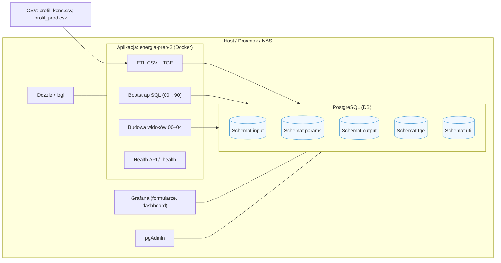
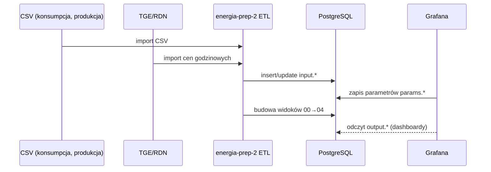
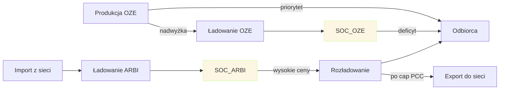

# Dokumentacja techniczna — energia-prep-2 (pełna, detaliczna)

> Wersja: 4.0  
> Repozytorium: `energia-prep-2-public`  
> Data: 2025-09-28  
> Autor: Zespół analityczny  

---

# Spis treści

1. Wprowadzenie i założenia
2. Architektura systemu i przepływy
3. Model danych wejściowych (`input.*`) i interpolacja
4. Parametry (`params.*`) — pełna specyfikacja
5. Widoki wyjściowe — opis szczegółowy (00→04)
6. Metodyka matematyczna (SOC, straty, capy, arbitraż)
7. Scenariusze godzinowe — studia przypadków
8. Wydajność, indeksy, alternatywy
9. Monitoring, testy, utrzymanie
10. Roadmapa i rozszerzenia
11. Aneks A: słownik pojęć
12. Aneks B: kontrola jakości danych (QA)
13. Aneks C: checklisty operacyjne

---

# 1. Wprowadzenie i założenia

## 1.1. Cel projektu
`energia-prep-2` przygotowuje spójne dane czasowe, oblicza przepływy energii i stan naładowania magazynu (SOC) w dwóch ścieżkach: **OZE** (autokonsumpcja/retencja) i **ARBI** (arbitraż cenowy). Wynik służy do raportowania, kalkulacji kosztów oraz dalszej optymalizacji.

## 1.2. Kontekst rynkowy
- Rynek Dnia Następnego (RDN) charakteryzuje się silną zmiennością cen godzinowych.
- Produkcja PV/wiatr jest niestabilna w czasie — nadwyżki i deficyty.
- Magazyny energii (BESS) pozwalają przesuwać energię i realizować arbitraż.

## 1.3. Założenia metodyczne
- **Czas**: wszystkie obliczenia w **UTC** (prezentacja lokalna przez `AT TIME ZONE`).  
- **Brak materialized view** — widoki liczone na żywo.  
- **Parametry**: zawsze pobierany **najnowszy** rekord (`ORDER BY updated_at DESC LIMIT 1`).  
- **SOC**: wyliczany godzina po godzinie, z uwzględnieniem strat i clampów.  
- **Arbitraż**: parowanie godzin *low/high* zgodnie z cenami RDN, z limitami (PCC, headroom, cycles_per_day).

---

# 2. Architektura systemu i przepływy

## 2.1. Komponenty


  
## 2.2. Przepływ danych (ETL → Views → Output)


## 2.3. Przepływy energii (logika wysokopoziomowa)


---

# 3. Model danych wejściowych (`input.*`) i interpolacja

## 3.1. `input.date_dim`
- Zakres: cały rok (8760/8784h).  
- Kolumny: `ts_utc`, `ts_local`, `day_key`, `hour_local`, `is_dst`, `dt_h` (zwykle 1h).  
- Służy do „wysycenia” osi czasu i ujednolicenia reszty danych.

## 3.2. `input.konsumpcja`, `input.produkcja`, `input.ceny_godzinowe`
- Pola surowe `*_raw` łączone z `date_dim`.  
- Puste luki (NULL) uzupełniane **interpolacją liniową** per kolumna.

### 3.2.1. Interpolacja liniowa — formuła
Dla zmiennej $x(t)$ znanej w $t_a$ i $t_b$, dla $t\in (t_a,t_b)$:
$$
x(t) = x(t_a) + \frac{x(t_b)-x(t_a)}{t_b - t_a}\cdot (t - t_a)
$$

### 3.2.2. Implementacja (idea)
- Wyznacz `ts_prev_*` i `ts_next_*` per kolumna.  
- Gdy `x_raw` jest NULL: licz $x$ z formuły powyżej; w innym wypadku $x = x_{raw}$.  
- Dzięki temu **brak NULL** w wyjściu.

### 3.2.3. Przykład (konsumpcja)
| ts_utc | p_load_mw_raw | p_load_mw (po) |
|---|---:|---:|
| 00:00 | 10.0 | 10.0 |
| 01:00 | NULL | 11.0 |
| 02:00 | 12.0 | 12.0 |

---

# 4. Parametry (`params.*`) — pełna specyfikacja

## 4.1. `params.form_zmienne`
| Parametr | Opis | Jednostka |
|---|---|---|
| `emax` | Pojemność magazynu | MWh |
| `procent_arbitrazu` | Udział pojemności na ARBI | % |
| `moc_pv_pp`, `moc_pv_wz`, `moc_wiatr` | Moce źródeł | MW |
| `zmiany_konsumpcji` | Korekta obciążenia | % |

## 4.2. `params.form_bess_param`
| Parametr | Opis | Jedn. | Typ |
|---|---|---|---|
| `eta_ch` | Sprawność ładowania | – | float |
| `eta_dis`| Sprawność rozładowania | – | float |
| `bess_lambda_month` | Samorozładowanie (mies.) | – | float |
| `c_rate_ch`, `c_rate_dis` | Limity mocy (na Emax) | 1/h | float |

Przeliczenie $\lambda$ miesięcznego na godzinowy mnożnik retencji $r_{hour}$:
$$
r_{hour} = (1-\lambda_{month})^{\frac{1}{H_{mon}}},\quad r_{step} = r_{hour}^{\Delta t}
$$

## 4.3. `params.form_par_arbitrazu`
| Parametr | Opis |
|---|---|
| `cycles_per_day` | Maksymalna liczba par low/high dziennie |
| `base_min_profit_pln_mwh` | Minimalna różnica cen (próg) |
| `bonus_ch_window`, `bonus_dis_window` | Korekty progów w wybranych oknach |
| `bonus_hrs_ch`, `bonus_hrs_dis` | Godziny z dodatkowymi preferencjami |
| `soc_low_threshold`, `soc_high_threshold` | Progi SOC do bonusów |
| `arbi_dis_to_load` | Czy rozładowanie preferencyjnie do odbioru |

Próg efektywny dla pary $(low, high)$:
$$
T_{pair}= \max\Big(0,~ T_{base} + B_{ch}(low) + B_{dis}(high)\Big)
$$

---

# 5. Widoki wyjściowe — opis szczegółowy (00→04)

## 5.1. `00_output_energy_base.sql` (Fundament)
**Zadania:**
1. Dołączenie `date_dim` do wejść.  
2. Interpolacja braków w: `p_load_mw`, `p_pv_pp_mw`, `p_pv_wz_mw`, `p_wiatr_mw`, `price_tge_pln`.  
3. Obliczenie:  
   - $P_{gen} = P_{pvpp} + P_{pvwz} + P_{wiatr}$  
   - $\Delta P = P_{gen} - P_{load}$  
   - $E_{\Delta} = \Delta P \cdot \Delta t$  
   - $E_{surplus} = \max(0, E_{\Delta})$  
   - $E_{deficit} = \max(0, -E_{\Delta})$

**Wyjścia kluczowe:** `e_delta_mwh`, `e_surplus_mwh`, `e_deficit_mwh`, `price_tge_pln`, `dt_h`.

## 5.2. `01_output_energy_broker_detail.sql` (Broker/PCC)
**Zadania:**
- Z mapowania z 00 wyznacza przepływy:  
  - **Ładowanie OZE**: zużywa nadwyżkę OZE do SOC_OZE.  
  - **Ładowanie ARBI**: z nadwyżki OZE **i/lub** z importu sieci (cap na grid).  
  - **Rozładowania**: do odbiorcy (preferencja) lub do sieci (cap PCC export).  
- Wystawia diagnostykę:  
  - `grid_export_used_by_surplus_mwh` (eksport zajęty przez OZE),  
  - `e_arbi_ch_from_grid_cap_net_mwh` (dostępny headroom do ładowania z sieci, NET).

**Zasada PCC (eksport):**  
$$
Export \leq Cap_{PCC}^{export} - Export_{zajęty~przez~OZE}
$$

## 5.3. `02_output_energy_soc_oze.sql` (SOC OZE)
**Równanie na krok $t$:**
$$
SOC^{OZE}_t = \min\Big(E^{OZE}_{max},~\max\big(0,~ SOC^{OZE}_{t-1} \cdot r_{step} + E^{OZE}_{ch,in} - E^{OZE}_{dis,out}\big)\Big)
$$
- $r_{step}$ – retencja z 4.2.  
- **Ścinki** (clamp): do $[0, E^{OZE}_{max}]$.  
- **Spill** do ARBI: nadwyżka wynikająca z clampa górnego (po stronie NET/GROSS zgodnie z η).

## 5.4. `03_output_energy_soc_arbi.sql` (SOC ARBI + arbitraż)
**Parowanie godzin** (dzień $d$):  
- `rank_low` — rosnąco po cenie, `rank_high` — malejąco.  
- Parujemy $(low_i, high_i)$, $i=1..n$, gdzie $n=\min(rang_{low}, rang_{high})$.  
- Dopuszczamy maksymalnie `cycles_per_day` par.

**Warunek opłacalności pary:**  
$$
\Delta Price = Price(high) - Price(low) \ge T_{pair}
$$
gdzie $T_{pair}$ z 4.3.

**Ruchy energii:**
- **Ładowanie**: z `spill_oze_to_arbi_net` i/lub z sieci do `SOC_ARBI`, z limitem `e_ch_cap_net_mwh` i headroomem $E^{ARBI}_{max}-SOC$.  
- **Rozładowanie**: do odbioru **lub** do sieci (z cap PCC), z limitem `e_dis_cap_net_mwh` i dostępnością `SOC_ARBI`.  

**Równanie SOC ARBI (krok $t$):**
$$
SOC^{ARBI}_t = \min\Big(E^{ARBI}_{max},~\max\big(0,~ SOC^{ARBI}_{t-1} \cdot r_{step} + E^{ARBI}_{ch,in} - E^{ARBI}_{dis,out}\big)\Big)
$$

**Uwagi operacyjne:**
- Jeśli `arbi_dis_to_load=true`: preferuj `deliver_to_load`, export tylko z wolnego headroomu PCC.  
- W obu kierunkach stosujemy η_ch, η_dis w pojęciu **NET** (po SOC) i **GROSS** (po stronie fizycznego przepływu).

## 5.5. `04_output_energy_store_summary.sql` (Summary)
- Łączy OZE i ARBI:  
  - `soc_total_mwh = soc_oze_mwh + soc_arbi_mwh`  
  - `grid_import_after_bess_mwh` (import netto po uwzględnieniu BESS)  
  - `in_grid_to_arbi_net_mwh` (wkład ładowania ARBI z sieci, NET)  
  - Straty: idle (retencja), η_ch/η_dis.

---

# 6. Metodyka matematyczna (SOC, straty, capy, arbitraż)

## 6.1. Czas i integracja energii
Energia godzinowa:  
$$
E = P \cdot \Delta t
$$
Zwykle $\Delta t=1\,h$, ale model dopuszcza odchylenia (np. DST).

## 6.2. Straty sprawności
- Ładowanie: $E^{SOC}_{+} = \eta_{ch} \cdot E^{gross}_{in}$  
- Rozładowanie: $E^{gross}_{out} = \frac{E^{SOC}_{-}}{\eta_{dis}}$  

## 6.3. Samorozładowanie (retencja)
Patrz 4.2: $r_{hour}=(1-\lambda_{month})^{1/H_{mon}}$, $r_{step}=r_{hour}^{\Delta t}$.  
Strata idle w kroku: $Loss^{idle} = SOC_{t-1} \cdot (1-r_{step})$.

## 6.4. Clamp
$$
SOC_t = \min(E_{max},~\max(0,~SOC^{raw}_t))
$$

## 6.5. Capy mocy (C-rate → energia na krok)
Dla maksymalnej pojemności $E_{max}$ i $c\_rate$ (1/h):  
$$
E^{cap}_{step} = c\_rate \cdot E_{max} \cdot \Delta t
$$

## 6.6. Arbitraż — próg efektywny
Z 4.3:  
$$
T_{pair} = \max\big(0,~base\_min\_profit + bonus\_ch(low)+bonus\_dis(high)\big)
$$

## 6.7. Kolejność decyzji w godzinie (pseudokod)
```text
1) policz retencję i headroom
2) jeżeli para(low/high) i okno spełnia T_pair → ustaw sygnały ch/dis
3) ładowanie: min(cap, headroom, źródła OZE + e_arbi_ch_from_grid_cap)
4) rozładowanie: min(cap, SOC, PCC-export-headroom) (lub do load)
5) zaktualizuj SOC, policz clampy i straty
```

---

# 7. Scenariusze godzinowe — studia przypadków

## 7.1. Dzień słoneczny (PV dominujące)

**Opis:** Nadwyżka w południe → ładowanie OZE; wieczorem deficyt → rozładowanie OZE. Export ograniczony PCC.

### Tabela (fragment, wartości przykładowe)
| Godz | Price | P_gen | P_load | ΔP | EΔ | SOC_OZE | SOC_ARBI | Import | Export |
|---:|---:|---:|---:|---:|---:|---:|---:|---:|---:|
| 10 | 220 | 3.5 | 2.0 | +1.5 | 1.5 | 4.0 | 1.0 | 0.0 | 0.2 |
| 12 | 180 | 4.0 | 1.8 | +2.2 | 2.2 | 5.0 | 1.2 | 0.0 | 0.5 |
| 19 | 700 | 0.1 | 2.3 | -2.2 | 2.2 | 3.5 | 1.2 | 0.8 | 0.0 |

## 7.2. Dzień bez OZE (arbitraż aktywny)
- Noc: ceny niskie → ładowanie ARBI z sieci.  
- Szczyt: ceny wysokie → rozładowanie ARBI do odbioru/sieci (po cap PCC).

## 7.3. Okna bonusowe (preferencje godzin)
- Bonusy obniżają próg w wybranych godzinach.  
- Przykład: `bonus_dis_window=+15` → rozładowanie dopuszczone przy mniejszej różnicy cen.

---

# 8. Wydajność, indeksy, alternatywy

## 8.1. Indeksy
- **UNIQUE BTREE** na `input.*(ts_utc)` dla joinów po czasie.  
- **BRIN** na dużych tabelach append-only (szybkie zakresy).  
- **DESC index** na `updated_at` w params i cenach (`latest row`).

## 8.2. Parametry serwera
- `jit=off`, `work_mem=256–512MB`, `max_parallel_workers_per_gather=4–8`, `effective_cache_size≈70% RAM`.

## 8.3. Alternatywy
- **PL/pgSQL** — iteracyjne SOC (szybsze niż recursive CTE).  
- **TimescaleDB** — hypertables, real-time aggregates.  
- **Citus (single-node)** — równoległość zapytań.  
- **pg_partman** — natywne partycjonowanie po czasie.

---

# 9. Monitoring, testy, utrzymanie

- **Health API**: `/_health/status.json` powinno zwrócić `{"status":"up"}`.  
- **Dozzle**: obserwacja logów ETL.  
- **Grafana**: dashboardy z `output.*`.  
- **Testy**: `tests/test_sql_order.py` (kolejność plików SQL).

---

# 10. Roadmapa i rozszerzenia

- Funkcje PL/pgSQL dla SOC (inkrementalne przebudowy zakresów).  
- Kolejka zmian i triggery (`output.recalc_queue`).  
- Integracja z Intraday (RT) i DSR.  
- Profile Taryfowe (opłaty sieciowe godzinowe).

---

# 11. Aneks A: słownik pojęć
- **SOC** — State of Charge, stan energii w magazynie [MWh].  
- **PCC** — punkt przyłączenia (limity import/export).  
- **C-rate** — krotność pojemności na jednostkę czasu.  
- **Headroom** — wolne miejsce w magazynie do ładowania.  
- **RDN** — Rynek Dnia Następnego.

---

# 12. Aneks B: kontrola jakości danych (QA)
- Spójność osi czasu (brak duplikatów godzin).  
- Brak NULL po interpolacji w `output.*`.  
- Ceny godzinowe: „najnowszy rekord” per godzina.  
- Walidacja jednostek (MW vs MWh).

---

# 13. Aneks C: checklisty operacyjne

## Cold start
1. `docker compose up -d --build`  
2. Sprawdź health API.  
3. Załaduj CSV.  
4. Pobierz ceny TGE.  
5. Zbuduj widoki 00→04.

## Po zmianach parametrów
1. Zapis w Grafanie → `params.*`.  
2. Widoki przeliczą się dynamicznie.  
3. Weryfikacja w dashboardach.

---

**Koniec dokumentu** — *Made with ❤️ for robust ETL & energy analytics.*
