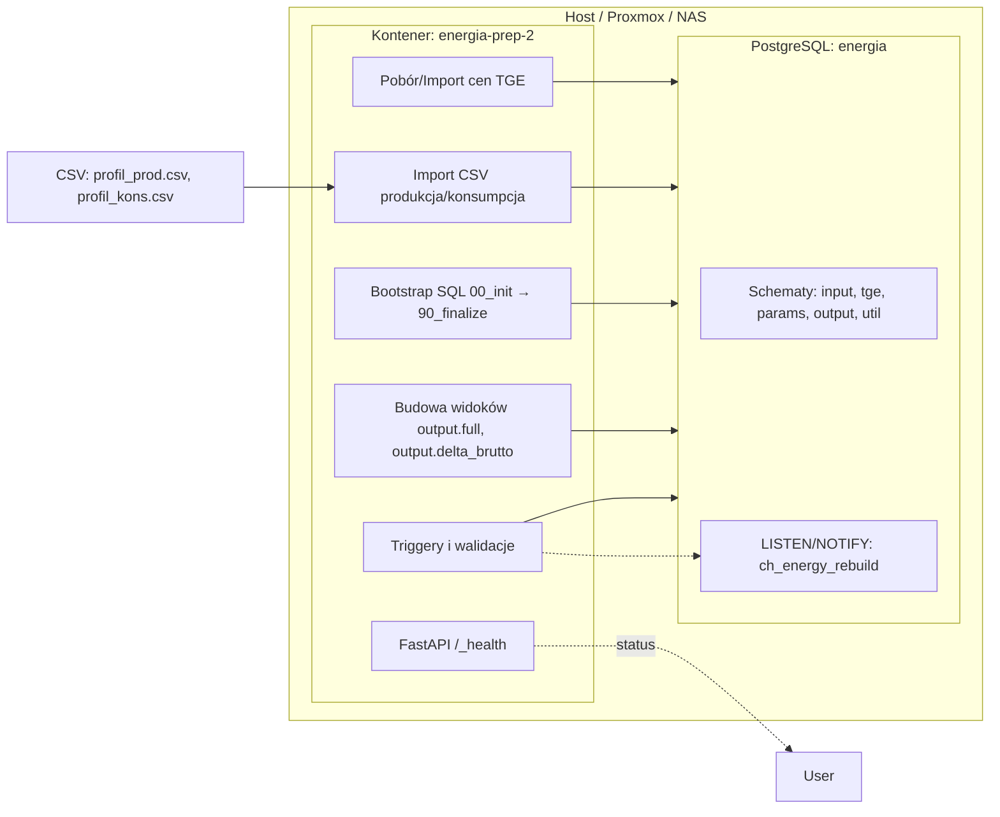
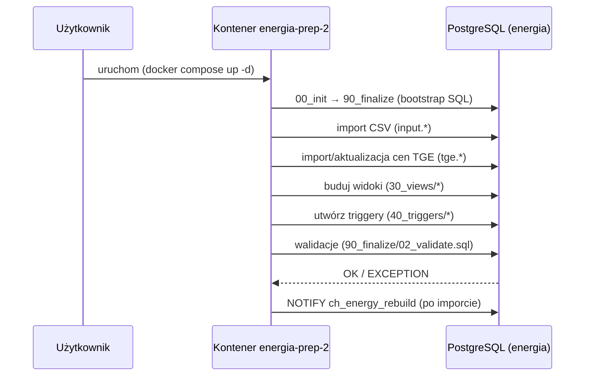

# energia-prep-2 — Pełna dokumentacja (ETL + API)

> Snapshot repo: aktualny stan gałęzi `main` z publicznego repozytorium. Dokument opisuje architekturę, procesy ETL, strukturę katalogów, każdy plik SQL i moduły Pythona, konfigurację `.env`, uruchamianie, monitoring oraz checklistę audytową.

## 🗺️ Architektura (wysoki poziom)


```mermaid
flowchart LR
  subgraph Host["Host / Proxmox / NAS"]
    subgraph PG["PostgreSQL: energia"]
      schemas["Schematy: input, tge, params, output, util"]
      notif["LISTEN/NOTIFY: ch_energy_rebuild"]
    end

    subgraph PREP["Kontener: energia-prep-2"]
      direction TB
      A1["Bootstrap SQL 00_init → 90_finalize"]
      A2["Import CSV produkcja/konsumpcja"]
      A3["Pobór/Import cen TGE"]
      A4["Budowa widoków output.full, output.delta_brutto"]
      A5["Triggery i walidacje"]
      API["FastAPI /_health"]
    end
  end

  files["CSV: profil_prod.csv, profil_kons.csv"] --> A2
  A3 --> PG
  A2 --> PG
  A1 --> PG
  A4 --> PG
  A5 --> PG
  A5 -.-> notif
  API -.status.-> User
```

**Rola komponentów**  
- **energia-prep-2**: deterministyczny bootstrap DB + ETL (CSV/TGE) + API zdrowia.  
- **PostgreSQL**: przechowuje wszystkie tabele (wejście, parametry, wyjścia), widoki i triggery.  
- **LISTEN/NOTIFY**: sygnalizacja do workera (energy-calc-6), że pojawiły się nowe dane do przeliczeń.

---

## 🚀 Szybki start

```bash
# 1) Przygotuj sekretne zmienne środowiskowe
cp .env.example .env
# uzupełnij .env (host DB, użytkownicy/hasła, ścieżki do CSV, port API)

# 2) Zbuduj i uruchom kontener
docker compose up -d --build

# 3) Sprawdź zdrowie API (z wnętrza sieci kontenerów)
curl -fsS http://energia-prep-2:8003/_health/status.json
# {"status":"up"}  <-- oczekiwane

# 4) Logi ETL + API
docker logs -f energia-prep-2
```

**Healthcheck** w `docker-compose.yml` odpytuje `/_health/status.json` i oczekuje `{"status":"up"}`.

---

## 📁 Struktura repo (wg. repo publicznego)

```
energia-prep-2
├─ .env
├─ .gitignore
├─ README.md
├─ config_form.yaml
├─ docker-compose.yml
├─ pyproject.toml
├─ data
│  ├─ .gitkeep
│  ├─ profil_kons.csv
│  └─ profil_prod.csv
├─ docker
│  ├─ .dockerignore
│  ├─ Dockerfile
│  └─ entrypoint.sh
├─ sql
│  ├─ 00_init
│  │  ├─ 00_prechecks.sql
│  │  ├─ 01_util_schema.sql
│  │  └─ 02_util_grants.sql
│  ├─ 10_schemas
│  │  └─ 01_bootstrap_schemas.sql
│  ├─ 20_tables
│  │  ├─ 01_input_tables.sql
│  │  ├─ 02_tge_tables.sql
│  │  ├─ 03_params_tables.sql
│  │  └─ 04_support_tables.sql
│  ├─ 30_views
│  │  ├─ 01_output_energy_broker_detail.sql
│  │  └─ 02_output_delta_brutto.sql
│  ├─ 40_triggers
│  │  ├─ 01_row_triggers.sql
│  │  └─ 02_event_triggers.sql
│  └─ 90_finalize
│     ├─ 01_post_grants.sql
│     └─ 02_validate.sql
├─ src
│  ├─ __init__.py
│  └─ energia_prep2
│     ├─ __init__.py
│     ├─ app_server.py
│     ├─ cfg.py
│     ├─ db.py
│     ├─ health_api.py
│     ├─ log.py
│     ├─ main.py
│     ├─ tasks
│     │  ├─ __init__.py
│     │  ├─ bootstrap.py
│     │  ├─ csv_import.py
│     │  ├─ date_dim.py
│     │  ├─ finalize.py
│     │  ├─ params_api.py
│     │  ├─ tge_fetch.py
│     │  └─ views_triggers.py
│     └─ utils
│        ├─ __init__.py
│        ├─ csv.py
│        ├─ dates.py
│        └─ fs.py
└─ tests
   ├─ test_cfg.py
   ├─ test_csv_detect.py
   └─ test_sql_order.py
```

---

## 🧩 SQL — opis każdego pliku

### `00_init/00_prechecks.sql`
- Weryfikacje wstępne: wersja serwera, kodowanie, strefa czasowa, obecność rozszerzeń (np. `pgcrypto` lub TimescaleDB – jeśli używana).  
- Twarde przerwanie bootstrapa (`RAISE EXCEPTION`) przy krytycznych brakach.

### `00_init/01_util_schema.sql`
- Tworzy schemat `util` na funkcje pomocnicze (walidacje, pomoc w grants/komentarzach).  
- Dobry punkt na funkcje typu: `util.ensure_role(name)` lub walidatory danych.

### `00_init/02_util_grants.sql`
- Spójny model uprawnień do schematu `util` (rola admin/app/ro).  
- Przygotowuje grunt pod resztę obiektów.

### `10_schemas/01_bootstrap_schemas.sql`
- Tworzy i porządkuje schematy: `input`, `tge`, `params`, `output`.  
- Ustala właścicieli i `search_path` jeśli potrzebne.

### `20_tables/01_input_tables.sql`
- Tabele szeregu produkcji i konsumpcji (`input.*`).  
- Klucze i indeksy po `ts`. Zalecenie: unikalność `ts` w każdej serii bazowej.

### `20_tables/02_tge_tables.sql`
- Tabele cen RDN (Instrat lub inne źródło).  
- Normalizacja do `price_pln_mwh` + indeks po `ts`.

### `20_tables/03_params_tables.sql`
- Zestawy parametrów (`params.*`) z kolumną czasu (`updated_at`/`created_at`) – ułatwia pobranie „najnowszego” zestawu.

### `20_tables/04_support_tables.sql`
- Słowniki, tabele pomocnicze (np. kalendarz, dni specjalne).

### `30_views/01_output_energy_broker_detail.sql`
- Widok kontrolny agregujący wejścia do jednego szeregu znormalizowanego czasowo.

### `30_views/02_output_delta_brutto.sql`
- Kluczowy widok wejściowy dla kalkulatora:  
  - `ts_utc` / `ts` / `ts_start`,  
  - `delta_brutto` (MW-avg w kroku **lub** MWh/krok),  
  - opcjonalnie `price_pln_mwh` (cena).

### `40_triggers/01_row_triggers.sql`
- Triggery wierszowe (INSERT/UPDATE) przygotowujące sygnał do NOTIFY po wsadach.

### `40_triggers/02_event_triggers.sql`
- Wywołuje `NOTIFY ch_energy_rebuild` po imporcie – informuje workera o nowym zestawie danych.

### `90_finalize/01_post_grants.sql`
- Zbiorcze `GRANT`y na odczyt (schemat `output`) dla ról raportowych.

### `90_finalize/02_validate.sql`
- Testy integralności: luki/duplikaty w czasie, zakresy wartości, brakujące ceny. W krytycznych przypadkach: `RAISE EXCEPTION`.

---

## 🐍 Python — moduły i rola

- `app_server.py` – FastAPI, endpoint `/_health/status.json`.  
- `health_api.py` – definicje tras/odpowiedzi zdrowia.  
- `main.py` – sterownik pipeline: bootstrap SQL → importy → widoki/triggery → start API.  
- `tasks/bootstrap.py` – wykonanie paczek SQL w deterministycznej kolejności.  
- `tasks/csv_import.py` – import CSV (auto-wykrywanie separatora, nagłówków; mapowanie; deduplikacja).  
- `tasks/tge_fetch.py` – pobór cen (Instrat/URL), normalizacja i insert.  
- `tasks/params_api.py` – ewentualny helper do parametrów.  
- `tasks/date_dim.py` – generatory wymiaru daty/godziny (jeśli używane).  
- `tasks/views_triggers.py` – budowanie widoków i triggerów.  
- `tasks/finalize.py` – grants, porządki.  
- `utils/csv.py|dates.py|fs.py` – pomoc: detektor CSV, operacje na datach, I/O plikowe.  
- `db.py` – połączenia i helpery do PostgreSQL.  
- `cfg.py` – centralna konfiguracja (czyta `.env`).  
- `log.py` – konfiguracja logowania (format, poziomy).

---

## ⚙️ Konfiguracja `.env` (przykład)

```ini
# --- DB ---
DB_HOST=postgres
DB_PORT=5432
DB_NAME=energia
DB_USER=voytek
DB_PASSWORD=change_me
DB_SUPERUSER=postgres
DB_SUPER_PASSWORD=change_me
DB_SSLMODE=disable

# --- API ---
API_HOST=0.0.0.0
API_PORT=8003
ALLOW_ORIGINS=*

# --- ETL (CSV) ---
DATA_DIR=/app/data
CSV_PRODUKCJA=/app/data/profil_prod.csv
CSV_KONSUMPCJA=/app/data/profil_kons.csv
CSV_SEP=;
CSV_DEC=,
CSV_DAYFIRST=1

# --- TGE ---
TGE_SOURCE=instrat
TGE_URL_BASE=https://example.tge/api/rdn
TGE_HISTORY_DAYS=365

# --- OGÓLNE ---
TZ=Europe/Warsaw
LOG_LEVEL=INFO
```

> Ustal własne wartości; haseł nie commituj. Zadbaj o spójność strefy czasu (zalecane UTC w DB i konwersje na krawędziach).

---

## 🔁 Kolejność procesu ETL


```mermaid
sequenceDiagram
  participant U as Użytkownik
  participant K as Kontener energia-prep-2
  participant DB as PostgreSQL (energia)

  U->>K: uruchom (docker compose up -d)
  K->>DB: 00_init → 90_finalize (bootstrap SQL)
  K->>DB: import CSV (input.*)
  K->>DB: import/aktualizacja cen TGE (tge.*)
  K->>DB: buduj widoki (30_views/*)
  K->>DB: utwórz triggery (40_triggers/*)
  K->>DB: walidacje (90_finalize/02_validate.sql)
  DB-->>K: OK / EXCEPTION
  K->>DB: NOTIFY ch_energy_rebuild (po imporcie)
```

---

## 🧪 Testy i monitoring

- Testy jednostkowe w `tests/*` (np. kolejność SQL, detekcja CSV, poprawność cfg).  
- Healthcheck kontenera (Docker) – `/_health/status.json`.  
- Zalecane: prosty **CI** w GitHub Actions – podnieś ephemeral PG, odpal `sql/*` + smoke test importu CSV.

---

## 📌 Checklista audytowa

- [ ] Indeksy po `ts` w `input.*` i `tge.*`.  
- [ ] Idempotencja CREATE (IF NOT EXISTS) i `CREATE OR REPLACE VIEW`.  
- [ ] Walidacje luk t=czas i duplikatów.  
- [ ] NOTIFY po wsadach dużych wsadowo (debounce po stronie workera).  
- [ ] `.env.example` bez sekretów.  
- [ ] Healthcheck działa i jest stabilny.  
- [ ] Wersjonowanie obrazu bazowego (digest) dla powtarzalności buildów.

---

## ❓ FAQ

**DST / zmiana czasu?** – ujednolicaj na UTC w DB (kolumny `timestamptz`); prezentację rób w strefie użytkownika.  
**Brak cen TGE?** – widoki mogą zwracać `NULL`; worker arbitrage wtedy wstrzymuje akcję cenową, OZE-first działa nadal.  
**Import CSV – separator, nagłówki?** – parametry w `.env`; detektor CSV w `utils/csv.py` potrafi je zgadnąć i rzuci błąd przy sprzecznościach.

---

Made with ❤️ for robust ETL.
